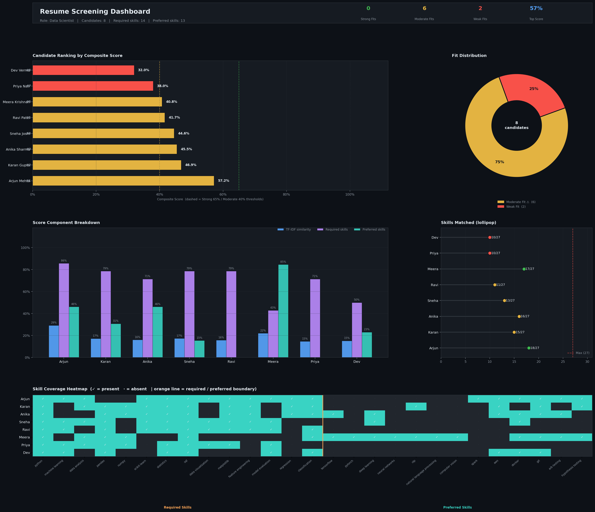

# FUTURE_ML_03-
Resume Screening
# Resume Screening System — Future Interns ML Task 3

## Overview
ML system that automatically screens, scores, and ranks resumes
against a job description using NLP and cosine similarity.

## Features
- Resume text cleaning & preprocessing (NLTK)
- Skill extraction using keyword NLP matching
- TF-IDF cosine similarity (resume vs job description)
- Weighted composite scoring:
  - TF-IDF Similarity → 40%
  - Required Skills Match → 45%
  - Preferred Skills Match → 15%
- Candidate ranking with fit labels (Strong / Moderate / Weak)
- Skill gap report per candidate
- 5-panel business-ready dark dashboard

## How to Run
pip install pandas numpy scikit-learn matplotlib nltk
python resume_screening.py

## Output

## Scoring Logic
| Component | Weight | Description |
|-----------|--------|-------------|
| TF-IDF Similarity | 40% | Overall text match with job description |
| Required Skills | 45% | Coverage of must-have skills |
| Preferred Skills | 15% | Bonus/nice-to-have skills |

## Fit Labels
| Label | Score Range |
|-------|------------|
| Strong Fit | ≥ 65% |
| Moderate Fit | 40–65% |
| Weak Fit | < 40% |

## Tools Used
Python | Scikit-learn | NLTK | Matplotlib | Pandas
